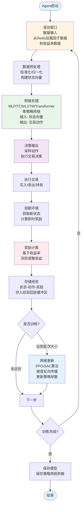
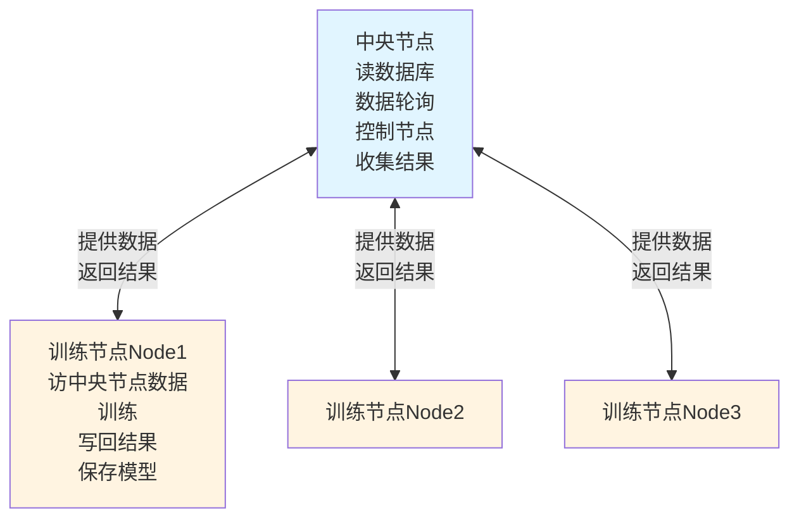
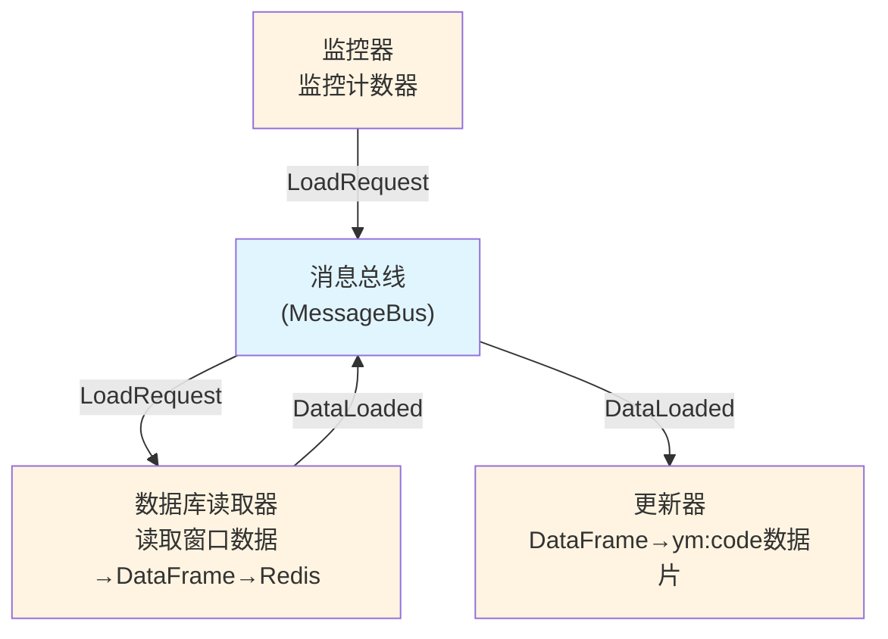
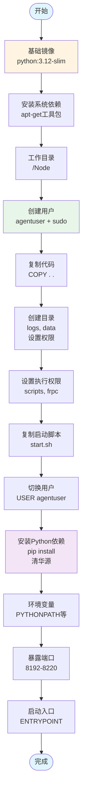
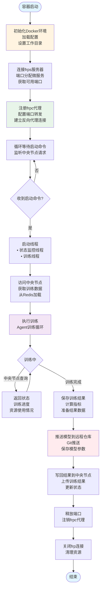

# 研究进度汇报

**汇报日期**: 2025年1月9日  
**研究题目**: 投资者预期协同的资产定价研究——基于AI-Agent视角

---

## 一、研究概述

### 1.1 研究目的

本研究旨在构建基于AI-Agent的预期分散度因子（AED, Agent-based Expected Dispersion），作为基准研究《投资者预期协同的资产定价研究——基于多特征机器学习视角》中IED（Investor Expected Dispersion）因子的改进版本。

**核心目标**：
- 使用AI-Agent模拟不同投资者的异质性预期
- 通过Agent的决策差异构建AED因子
- 检验AED因子在资产定价中的有效性

### 1.2 核心创新点

1. **Agent替代神经网络**：使用AI-Agent代替随机初始化的神经网络，通过更灵活的异质性设计模拟投资者差异
2. **异质性设计**：
  - 信息能力，包括获取的数据量、窗口大小、分析能力等  
  - 网络异质性，使用不同的神经网络结构，如MLP,TCN,LSTM,Transformer-llm等  
3. **端到端学习**：采用强化学习直接学习交易策略，而非预测收益率后再决策

---

## 二、参考项目

本研究参考了以下开源项目和技术框架：

### 2.0 基准研究  
- 网络结构：单层感知机  
- 训练方式：单证券 + 单月份 + 滚动窗口训练  
- 异质性来源：初始化权重矩阵，模拟对不同因子的注意力  

### 2.1 Agent-Lightning
- **用途**：RL训练LLM的框架，用于Agent的强化学习训练
- **参考点**：Agent训练流程、RL算法集成

### 2.2 AI-Hedge-Fund
- **用途**：多LLM-Agent投资系统
- **参考点**：
  - Agent设计模式   
  - 决策机制（离散动作+置信度）  
  - 多Agent协同工作方式  
- 问题：没有训练的信息  

### 2.3 TwinMarket
- **用途**：LLM驱动的市场模拟系统
- **参考点**：
  - 单AI决策（信息->belief->决策）  
  - 模拟交易市场  
- 问题：同样没有训练信息  

### 2.4 HuggingFace / Transformer
- **用途**：基于torch的llm模型框架，是可以调参的模型  
- **参考点**：
  - LLM模型加载和训练（如Qwen2.5-1.5B）
  - Transformer架构理解
  - 模型微调方法

### 2.5 FinRL
- **用途**：金融强化学习框架
- **参考点**：
  - 多证券决策 
    - 输入：（m只证券 * 每个证券n个特征 + 现金）展品为单维向量  
    - 输出：m只证券+现金的决策空间   
  - 建模方式：单层感知机 + RL(DPO,PPO等算法)   
  - 奖励函数：资产组合收益率，风险，夏普等组合  

### 2.6 Stable Baselines3 (SB3)
- **用途**：强化学习算法库
- **参考点**：
  - PPO、SAC等RL算法实现
  - MLP策略网络设计
  - 训练流程标准化

---

## 三、Agent设计  
### 3.1 agent工作流程    
**agent流程**：agent由数据输入，网络和决策和奖励强化四个部分组成，具体流程为：  

### 3.2 数据预处理   
- 每次加载一个窗口（一般为12个月）的全量证券（如3500个）数据，共12 * 88 * 3500 个数据    
- 标准化：以月为单位，横向标准化(证券，因子)
  - eg. 202501-qr因子，求所有证券的qr均值$\mu$和标准差$\sigma$，对于某个证券i，标准化其$qr_{i,stan} = \frac{qr_i - \mu}{\sigma}$   

### 3.3 输入  
### 3.3 输入方式

尝试不同的输入方式，探索最优的特征表示：

| 类型 | 数据形状 | 示例 | 特征维度 |
|------|---------|------|---------|
| 1. 单月单证券向量 | (1, 88) | 证券000001在202501月的88个因子 | 88 |
| 2. 多月单证券序列 | (T, 88) | 证券000001在T个月窗口内的因子序列 | T×88 |
| 3. 多月单证券矩阵 | (T, 88) | 同上，但以矩阵形式组织 | T×88 |
| 4. 多月多证券张量 | (T, N, 88) | T个月窗口内N个证券的因子数据 | T×N×88 |  

- **1. 单月单证券向量**（形状：$(88,)$）
  - 示例：$202501\text{-}000001\text{-}(qr, mom36, \ldots)$
  - 数学表示：$\mathbf{x}_{t,s} \in \mathbb{R}^{88}$，其中 $t$ 为月份，$s$ 为证券代码

- **2. 多月单证券序列**（形状：$(T, 88)$）
  - 示例：$000001\text{-}(qr_{202501}, mom36_{202501}, \ldots, qr_{202502}, \ldots)$
  - 数学表示：$\mathbf{X}_s = [\mathbf{x}_{t_1,s}; \mathbf{x}_{t_2,s}; \ldots; \mathbf{x}_{t_T,s}] \in \mathbb{R}^{T \times 88}$

- **3. 多月单证券矩阵**（形状：$(T, 88)$）
  - 与方式2相同，但以矩阵形式组织：$\mathbf{M}_s \in \mathbb{R}^{T \times 88}$

- **4. 多月多证券张量**（形状：$(T, N, 88)$）
  - 数学表示：$\mathcal{T} = [\mathbf{X}_{s_1}; \mathbf{X}_{s_2}; \ldots; \mathbf{X}_{s_N}] \in \mathbb{R}^{T \times N \times 88}$
  - 其中 $T=12$（月数），$N=3500$（证券数），$88$   

### 3.4 输出  
### 3.4 输出

Agent的输出格式根据任务类型分为以下四种：

| 输出类型 | 数据形状 | 数学表示 | 输出内容 | 应用场景 |
|---------|---------|---------|---------|---------|
| **1. 单证券收益预测** | $(1,)$ | $\hat{r}_s \in \mathbb{R}$ | 单个证券的预期收益率（标量） | 回归任务，预测单个证券未来收益 |
| **2. 多证券收益预测** | $(N,)$ | $\hat{\mathbf{r}} = [\hat{r}_{s_1}, \hat{r}_{s_2}, \ldots, \hat{r}_{s_N}]^T \in \mathbb{R}^{N}$ | $N$ 个证券的预期收益率向量 | 批量预测，同时预测多个证券收益 |
| **3. 单证券决策** | $(3,)$ 或 $(1,)$ | $\mathbf{a}_s \in \{0, 1, 2\}$ 或 $\mathbf{a}_s \in [0, 1]$ | 离散动作：买入/持有/卖出，或连续动作：持仓权重 | 单证券交易决策，动作空间为3类或连续 |
| **4. 多证券+现金决策** | $(N+1,)$ | $\mathbf{w} = [w_0, w_1, w_2, \ldots, w_N]^T \in \mathbb{R}^{N+1}$ 约束：$\sum_{i=0}^{N} w_i = 1, w_i \geq 0$ | 投资组合权重向量，$w_0$ 为现金权重，$w_{1:N}$ 为各证券权重 | 投资组合优化，包含现金配置 |

**详细说明**：

- **1. 单证券收益预测**
  - 输出：$\hat{r}_s \in \mathbb{R}$，表示证券 $s$ 的预期收益率
  - 示例：$\hat{r}_{000001} = 0.025$ 表示证券000001预期收益率为2.5%
  - 网络输出层：单神经元，线性激活

- **2. 多证券收益预测**
  - 输出：$\hat{\mathbf{r}} \in \mathbb{R}^{N}$，向量形式
  - 示例：$\hat{\mathbf{r}} = [0.025, -0.01, 0.03, \ldots]^T$ 表示各证券的预期收益
  - 网络输出层：$N$ 个神经元，线性激活

- **3. 单证券决策**
  - **离散动作**：$\mathbf{a}_s \in \{0, 1, 2\}$，其中 $0$=卖出，$1$=持有，$2$=买入
    - 网络输出层：3个神经元 + Softmax，采样得到动作
  - **连续动作**：$\mathbf{a}_s \in [0, 1]$，表示持仓权重（0=空仓，1=满仓）
    - 网络输出层：单神经元 + Sigmoid

- **4. 多证券+现金决策**
  - 输出：$\mathbf{w} \in \mathbb{R}^{N+1}$，投资组合权重向量
  - 约束条件：
    $$
    \sum_{i=0}^{N} w_i = 1, \quad w_i \geq 0 \quad \forall i
    $$
  - 其中 $w_0$ 表示现金权重，$w_{1:N}$ 表示各证券权重
  - 网络输出层：$(N+1)$ 个神经元 + Softmax（自动满足权重和为1）
  - 示例：$\mathbf{w} = [0.2, 0.3, 0.1, 0.15, 0.25, \ldots]^T$ 表示20%现金，30%证券1，10%证券2，...

### 3.5 奖励函数   
多种奖励函数，根据任务类型和评估目标选择：

| 类别 | 奖励函数 | 公式 | 说明 |
|------|---------|------|------|
| **预测准确率** | 预测误差 | $R = \hat{r} - r$ | 负绝对误差，预测越准确奖励越高 |
| | 方向准确率 | $R = \text{sign}(\hat{r} \cdot r)$ | 预测方向正确为+1，错误为-1，关注方向而非精确值 |
| | 相关系数 | $R = \text{Corr}(\hat{\mathbf{r}}, \mathbf{r})$ | 预测值与真实值的相关系数，评估多证券预测整体相关性 |
| **单证券-现金组合** | 收益 | $R = w_s r_s + w_0 r_f$ | $w_s$为证券权重，$r_s$为证券收益，$w_0$为现金权重，$r_f$为无风险利率 |
| | 风险 | $R = -\sigma_p$，$\sigma_p = w_s \cdot \sigma_s$ | $\sigma_s$为证券波动率，风险惩罚项，波动越大奖励越低 |
| | 夏普比率 | $R = \frac{R_p - r_f}{\sigma_p}$ | $R_p$为组合收益，$r_f$为无风险利率，$\sigma_p$为组合波动率，衡量风险调整后收益 |
| | Alpha | $R = R_p - (r_f + \beta(R_m - r_f))$ | $\beta$为Beta系数，$R_m$为市场收益，衡量超越基准的超额收益 |
| | 加权组合 | $R = \sum_i \lambda_i R_i$ | $\sum_i \lambda_i = 1$为权重系数，多指标加权，平衡收益与风险 |
| **多证券-现金组合** | 收益 | $R = \sum_{i=1}^{N} w_i r_i + w_0 r_f$ | $w_i$为证券$i$权重，$r_i$为证券$i$收益，计算多证券组合总收益 |
| | 风险 | $R = -\sqrt{\mathbf{w}^T \boldsymbol{\Sigma} \mathbf{w}}$ | $\boldsymbol{\Sigma}$为协方差矩阵，$\mathbf{w}$为权重向量，考虑证券间相关性的组合风险 |
| | 夏普比率 | $R = \frac{R_p - r_f}{\sigma_p}$ | $R_p = \sum_{i=1}^{N} w_i r_i + w_0 r_f$，$\sigma_p = \sqrt{\mathbf{w}^T \boldsymbol{\Sigma} \mathbf{w}}$，多证券组合的风险调整收益 |
| | Alpha | $R = R_p - (r_f + \boldsymbol{\beta}^T \mathbf{w}(R_m - r_f))$ | $\boldsymbol{\beta}$为各证券Beta向量，衡量多证券组合的超额收益 |
| | 最大回撤 | $R = -\max_t \text{DD}_t$，$\text{DD}_t = \frac{\text{Peak}_t - \text{Value}_t}{\text{Peak}_t}$ | 回撤惩罚项，控制下行风险，$\text{Peak}_t$为历史峰值 |
| | 信息比率 | $R = \frac{R_p - R_b}{\sigma_{\text{active}}}$ | $R_b$为基准收益，$\sigma_{\text{active}}$为主动风险，衡量相对基准表现 |
| | 加权组合 | $R = \sum_j \lambda_j R_j$ | $\sum_j \lambda_j = 1$为权重系数，$R_j$为各项指标，多指标综合评估 |

**注意**：  
- 1.在使用加权组合作为奖励函数时，需要横向标准化(如对于证券i窗口t，分别求t窗口所有证券的收益率、风险、夏普、回撤等的均值和标准差，然后对i的各个指标进行标准化)   
- 2.agent持有资产组合，收益、风险、夏普的计算基于agent持有资产组合的历史价值来计算，而非某个证券的价值   

## 四、系统架构设计

### 4.1 整体架构

系统采用**分布式节点架构**，包含以下组件：

- **主机（Master）**：负责数据管理、任务调度、结果收集
- **训练节点（Node）**：运行Agent训练任务，通过Docker容器化部署

### 4.2 数据流水线（重点）

数据流水线是中央系统的核心，需求是避免一次性加载过量数据到内存，符合滚动窗口的训练需求，为节点提供足够的数据：  
- 1.采用事件驱动   
- 2.使用redis作为中间件  

具体流程如下: 

- 监控器负责监控redis，维护数据数据片数量（数量需略大于窗口，保证冗余，不阻塞node）  
  - 1.以ym:code作为数据片  
  - 2.node访问后，为ym:code计数器+1  
  - 3.当所有节点访问数据片后，将其踢出redis   
- 一旦数据片数量低于阈值，发送加载数据请求给MB   
- 数据读取器接受加载请求，加载数据到redis，并发布更新请求    
- 更新器处理df（标准化，null处理），然后分割为数据片   
- 所有接受请求和处理异步线程执行，不会阻塞系统    

### 4.3 节点结构  
#### 4.3.1 docker初始化  
节点使用docker初始化，docker初始化流程为：  

### 4.3.2 启动流程  
使用frp反向代理，容器会暴露一个端口，这个端口负责接受  
- 1.中央节点的启动命令  
- 2.中央节点的状态查询  

---

## 五、当前进度

### 5.1 已完成模块

#### ✅ Redis连接管理
- **文件**: `src/manager/redis/connection.py`
- **功能**:
  - Redis连接自动管理
  - 健康检查机制（每30秒）
  - 自动重连（最大重试3次）
  - YAML配置支持
  - 连接池支持（可选）
- **状态**: 已完成并测试

#### ✅ 消息总线
- **文件**: `src/manager/service/bus.py`
- **功能**:
  - 异步消息发布/订阅
  - 消息类型路由
  - 守护线程处理
  - Redis队列实现
- **状态**: 已完成并测试

#### ✅ 数据库加载器
- **文件**: `src/manager/service/database_loader.py`
- **功能**:
  - 从PostgreSQL加载因子数据（88个表并行查询）
  - 从PostgreSQL加载收益率数据
  - 数据序列化存储到Redis
  - 响应初始化请求
- **状态**: 已完成，支持初始化数据加载

#### ✅ 因子数据查询模块
- **文件**: `src/manager/database/factors.py`
- **功能**:
  - 并行查询多个因子表
  - 支持时间范围查询
  - Polars DataFrame处理
  - 数据合并和清洗
- **状态**: 已完成

#### ✅ frp端口分配微服务  
- **文件**：`docs/过程资料/说明文档/基于flask的frp端口自动分配微服务/checkapp.py.backup`
- **功能**：访问端口，获取一个没被占用的frps端口   
- **状态**：已经完成，启动服务  

#### ✅ 节点基础设施
- **文件**: `Node/DockerFile`, `Node/start.sh`
- **功能**:
  - Docker容器化部署
  - frp反向代理集成
  - 自动启动脚本
  - 日志管理
- **状态**: 已完成，支持一键部署  

### 5.2 进行中模块

#### 🔄 数据轮询机制
- **需求**: 按窗口大小（12个月）和时间步（1个月）自动加载数据
- **进度**: 数据加载器已实现，需要完善轮询逻辑
- **待完成**: 
  - 实现`TrainDataUpdater`类
  - 实现滑动窗口数据更新
  - 实现Redis数据清理机制

#### 🔄 节点通信
- **需求**: TCP通信协议，用于发送Agent配置和接收训练结果
- **进度**: frp已配置，TCP服务器框架已搭建
- **待完成**:
  - 完善TCP通信协议
  - 实现Agent配置发送
  - 实现训练结果收集

#### 🔄 Agent配置管理
- **需求**: 根据节点数量生成Agent配置（JSON格式）
- **进度**: 配置结构已设计
- **待完成**:
  - 实现配置生成逻辑
  - 实现配置验证
  - 实现配置分发

### 5.3 待完成模块

#### ⏳ Agent训练模块
- **需求**: 基于强化学习的MLP策略网络训练
- **技术方案**:
  - 使用Stable Baselines3框架
  - MLP网络结构：输入层(88因子+持仓+现金) → 隐藏层(512→256→128) → 输出层(决策深度-10~10)
  - PPO算法训练
  - 多种奖励函数（Sharpe最大化、收益最大化、风险调整等）
- **状态**: 未开始

#### ⏳ AED因子计算
- **需求**: 基于Agent决策差异计算AED因子
- **方法**:
  - 收集所有Agent的决策值
  - 计算决策方差或标准差
  - 生成AED因子序列
- **状态**: 未开始

#### ⏳ 因子有效性检验
- **需求**: 检验AED因子的定价能力
- **方法**:
  - 多空组合检验（高AED vs 低AED）
  - Fama-MacBeth回归
  - CAPM Alpha检验
  - 异质性分析
- **状态**: 未开始

---

**文档版本**: v1.0  
**最后更新**: 2025年1月8日

